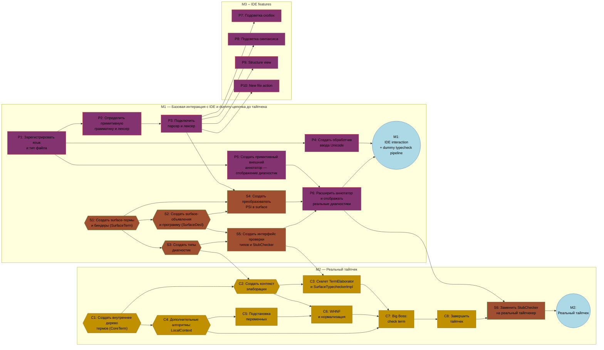

## Dependency Diagram


---

## Legend

| Shape         | Meaning             |
| ------------- | ------------------- |
| `[rectangle]` | Regular task        |
| `{{hexagon}}` | Data-structure task |
| `((circle))`  | Milestone           |

| Color  | Team      |
| ------ | --------- |
| Green  | Plugin    |
| Brown  | Surface   |
| Orange | Core      |
| White  | Milestone |

---

# Именование проекта

- **Название проекта и языка:** Delta Type Theory
- **Имя репозитория:** `delta-type-theory`
- **Префикс Kotlin-классов:** `DeltaTypeTheory.bnf`
- **Корневой package:** `camp.delta.deltatypetheory`
- **Расширение исходных файлов:** `.delta`
- **ID языка в IntelliJ Platform:** `DeltaTypeTheory.bnf`

---

# Предпосылка
1. Gradle-module сделан
2. `plugin.xml` регистрирует язык, но больше ничего


# План

1. Регистрируем язык в IDE + лексер и парсер
2. Surface-типы
3. Начинаем разрабатывать ядро

## Команда Плагин

### P1: Зарегистрировать язык и тип файла
- **Команда:** plugin
- **Этап:** M1
- **Задача:** Создать `DeltaTypeTheoryLanguage` и `DeltaTypeTheoryFileType`, зарегистрировать тип файла.
- **Цель:** Сообщить IntelliJ: «существует язык Delta Type Theory, а файлы `.delta` являются файлами этого языка».
- **Как делать:**
  Создайте в package `camp.delta.deltatypetheory.plugin.language` два объекта (ключевое слово `object`):
  - `DeltaTypeTheoryLanguage`, представляющий язык Delta Type Theory в IntelliJ Platform;
    должен быть наследовать IntelliJ-класс `Language` и иметь ID `DeltaTypeTheory.bnf`.
  - `DeltaTypeTheoryFileType`, представляющий тип файлов этого языка;
    должен наследовать `LanguageFileType` и связан с `DeltaTypeTheoryLanguage`
  - Зарегистрируйте `DeltaTypeTheoryFileType` в `plugin.xml` через extension point `com.intellij.fileType`.
- **AC:** IntelliJ распознаёт файлы `.delta` и показывает имя или значок типа файла Delta Type Theory.

---

### P2: Определить примитивную грамматику и лексер
- **Команда:** plugin
- **Этап:** M1
- **Задача:** Создать минимальные .bnf и .flex и зарегистрировать их.
- **Как делать:**
  - Создайте в `main/grammar` файлы `DeltaTypeTheory.bnf` и `DeltaTypeTheoryLexer.flex`.
  - Инструменты, которые мы будем использовать называется `Grammar-Kit` и `JFlex`. Узнайте, что это такое и опишите грамматику нашего языка.
  - Gradle-задача `generateLexer` и `generateParser` должны будут по этим файлам сгенерировать множество java-классов (задача уже реализована).
  - Токены должны быть следующими:
    - Декларации: `axiom`, `def`
    - Символы: `:=`, `→`, `=>`, `λ`, `:`, `(`, `)`, `;`
    - Identifiers
    - Комментарий и whitespaces
  - Грамматика должна описывать dependent lambda calculus синтаксис:
    - Файл -- список элементов
    - Каждый элемент -- либо декларация аксиомы, либо определения
    - Аксиома -- `axiom имя : expr ;`
    - Определение -- `def имя : expr := expr ;`
    - `имя` -- identifier
    - `expr` -- либо лямбда-выражение, либо П-выражение, либо application
    - и так далее.
  - Вы должны понять как именно задать грамматику так, чтобы следующая программа успешно парсилась
  ```
  axiom natRec :
    (P : (n : Nat) → Type) →
    (_ : P(zero)) →
    (s : (n : Nat) → (ih : P(n)) → P(succ(n))) →
    (n : Nat) →
    P(n);
  
  def plus : (m : Nat) → (n : Nat) → Nat :=
    λ (m : Nat) => λ (n : Nat) =>
    natRec(λ (x : Nat) => Nat)(n)(
    λ (x : Nat) => λ (ih : Nat) => succ(ih)
    )(m);
  ```
  - Вам придётся в файле .bnf зарегистрировать elementTypeClass и tokenTypeClass.  Для этого создайте классы `DeltaTypeTheoryElementType : IElementType` и `DeltaTypeTheoryTokenType : IElementType` в `camp.delta.deltatypetheory.plugin.psi`. Они должны быть тривиальны, но должны привязать сгенерированные токены и типы к `DeltaTypeTheoryLanguage`.

- **AC:**
  - корректная грамматика и привязка к языку

---

### P3: Подключить парсер и лексер
- **Команда:** plugin
- **Этап:** M1
- **Задача:** Создать `DeltaTypeTheoryParserDefinition` и `DeltaTypeTheoryJFlexLexer`.
- **Цель:** Подключить сгенерированные лексер и парсер к редакторной системе IntelliJ.
- **Подробности:**
  - `class DeltaTypeTheoryJFlexLexer : FlexAdapter(_DeltaTypeTheoryLexer())` оборачивает сгенерированный лексер,
    чтобы IntelliJ могла его использовать.
    - package: `camp.delta.deltatypetheory.plugin.lexer`
  - `class DeltaTypeTheoryParserDefinition : ParserDefinition`:
    - `createLexer` → `DeltaTypeTheoryJFlexLexer()`
    - `createParser` → `DeltaTypeTheoryJFlexParser()` -- сгенерированный парсер
    - `createFile(viewProvider)` → `DeltaTypeTheoryFile(viewProvider)`
    - `createElement(node)` → `DeltaTypeTheoryType.Factory.createElement(node)` -- сгенерированная фабрика
    - `getWhitespaceTokens` → `TokenType.WHITE_SPACE`
    - `getCommentTokens` → `DeltaTypeTheoryType.COMMENT`
    - `getStringLiteralElements` → `TokenSet.EMPTY`, поскольку строковых литералов в языке нет
    - package: `camp.delta.deltatypetheory.plugin.parser`
  - Зарегистрировать `<extensionPoint lang.parserDefinition>` в `plugin.xml`.
- **AC:** При открытии файла `.delta` в IntelliJ отображается корректно разобранное дерево; корректный файл не содержит ошибок парсинга.

---

### P4: Создать обработчик ввода Unicode
- **Область:** plugin
- **Этап:** M1
- **Задача:** Создать `DeltaTypeTheoryUnicodeInputHandler`.
- **Цель:** Позволить пользователям вводить сокращения в стиле LaTeX, разворачивающиеся в Unicode-символы.
- **Подробности:**
  - `class DeltaTypeTheoryUnicodeInputHandler : TypedHandlerDelegate`
  - Активен только тогда, когда открыт файл `.delta` и введённый символ является пробелом.
  - При вводе пробела просматривать текст назад от каретки в поиске `\`, за которым идут буквы или цифры.
  - Если текст совпадает с известным сокращением, заменять его Unicode-символом и пробелом.
  - Сокращения:
    - `\to` → `→`
    - `\ ` → `λ`
    - `\mN` → `ℕ`
    - `\forall` → `∀`
    - `\exists` → `∃`
  - Зарегистрировать `<extensionPoint typedHandler>` в `plugin.xml`.
- **AC:** Ввод `\to ` в файле `.delta` вставляет `→ ` и прочее.

---

### P5: Создать примитивный внешний аннотатор -- отображение диагностик
- **Область:** plugin
- **Этап:** M1
- **Задача:** Создать `DeltaTypeTheoryExternalAnnotator` и поэкспериментировать с ним.
- **Цель:** Запускать проверку типов для файла и показывать её диагностики -- ошибки и предупреждения -- в виде подсветки в редакторе.
- **Подробности:**
  - package: `camp.delta.deltatypetheory.plugin.annotator`
  - `class DeltaTypeTheoryExternalAnnotator : ExternalAnnotator<Тип A, Тип B>()`. Этот класс должен переопределить три метода: `collectInformation`, `doAnnotate`, `apply`. Если эти методы переопределены корректно, то IntelliJ сама сможет потом их использовать, чтобы составить подсветку ошибок.
  - Три фазы:
    1. `collectInformation(file, editor, hasErrors) : Тип A` выполняется в UI-потоке.
       Принять файл и выдать какую-то информацию в виде типа А
    2. `doAnnotate(collectedInfo)` выполняется в фоновом потоке, не в UI-потоке. Позже тут будет вызываться тайпчекер и мы получим отсюда диагностики. На данный момент может быть тривиальным. Возвращает диагностики как `тип B`.
    3. `apply(file, annotationResult, holder)` выполняется в UI-потоке.
       Тут надо поэкспериментировать с тем как создавать аннотации и подсветку ошибок. `holder.newAnnotation(...).range(...).create()` -- способ это сделать.
  - Зарегистрируйте `<extensionPoint externalAnnotator>` в `plugin.xml`.
  - Реализовать `DumbAware`, чтобы аннотатор работал даже во время индексации.
- **Критерии приёмки:** В файле `.delta` показывается что-нибудь разными цветами, например длина файла или число слов. Придумайте, главное, чтобы IntelliJ реагировала на файл.

---

### P6: Расширить аннотатор и отображать реальные диагностики
- **Область:** plugin
- **Этап:** M1
- **Задача:** Создать `DeltaTypeTheoryExternalAnnotator`.
- **Цель:** Запускать проверку типов для файла и показывать её диагностики -- ошибки и предупреждения -- в виде подсветки в редакторе.
- **Подробности:**
  - Три фазы:
  - `class DeltaTypeTheoryExternalAnnotator :
  ExternalAnnotator<DeltaTypeTheoryCollectedInfo, List<SurfaceDiagnostic>>()`
  - Теперь у него должно быть два приватных поля:
    -   `private val converter = PsiToSurfaceConverter()`
    -   `private val typechecker = StubSurfaceTypechecker`
    1. `collectInformation(file, editor, hasErrors)`:
       Преобразовать разобранный файл в `SurfaceProgram` с помощью конвертера. Обернуть в try/catch; если преобразование завершилось ошибкой, создать диагностику ошибки.
       Вернуть собранную информацию.
    2. `doAnnotate(collectedInfo)`. Вызвать `typechecker.check(program)` и получить диагностики. Обернуть в try/catch и вернуть список диагностик.
    3. `apply(file, annotationResult, holder)`.
       Для каждой диагностики создать аннотацию IntelliJ:
    - сопоставить важность: Error → `ERROR`, Warning → `WARNING`, Info → `WEAK_WARNING`;
    - преобразовать `SourceRange` в IntelliJ `TextRange`, ограничив смещения допустимыми границами;
    - создать аннотацию с сообщением диагностики и диапазоном текста.
  - Зарегистрировать `<extensionPoint externalAnnotator>` в `plugin.xml`.

- **Критерии приёмки:** Ошибка в файле `.delta`, например дублирующееся имя, отображается как подсвеченная диагностика в редакторе, аналогично синтаксической ошибке в обычном языке программирования.

---
### P7: Сделать поддержку скобок
- **Область:** surface
- **Этап:** M3
- **Задача:** Сделать работу со скобками удобной!
- **Подробности:** (нет)
- **AC:** (нет)

---
### P8: Create syntax highlighting (colors for tokens)
- **Scope:** plugin-ide
- **Milestone:** M3
- **Task:** Create `DeltaTPSyntaxHighlighter` and `DeltaTPSyntaxHighlighterFactory`.
- **Purpose:** Color-code keywords, comments, identifiers, and operators in the editor.
- **Details:**
  - `DeltaTPSyntaxHighlighter : SyntaxHighlighterBase`:
    - `getHighlightingLexer()` → `DeltaTPJFlexLexer()`
    - `getTokenHighlights(tokenType)` — map each token type to a color category:
      - Keywords (`axiom`, `def`, `rule`) → keyword color
      - Comments → comment color
      - Identifiers → identifier color
      - Operators/punctuation → operator color
      - Bad characters → error color
  - `DeltaTPSyntaxHighlighterFactory : SyntaxHighlighterFactory`:
    - `getSyntaxHighlighter(project, virtualFile)` → new `DeltaTPSyntaxHighlighter()`
  - Register `<extensionPoint lang.syntaxHighlighterFactory>` in `plugin.xml`.
  - Change class names if appropriate
- **Acceptance criteria:** Keywords like `axiom` appear in a different color than identifiers (and other features).

---

### P9: Create the structure view
- **Scope:** plugin
- **Milestone:** M3
- **Task:** Create `DeltaTPStructureViewFactory`, `DeltaTPStructureViewModel`,
  and `DeltaTPStructureViewElement`.
- **Purpose:** Show an outline of the file's declarations in the Structure tool window.
- **Details:**
  - `DeltaTPStructureViewFactory : PsiStructureViewFactory` — creates the model.
  - `DeltaTPStructureViewModel` -- rooted at the file; lists axiom/def/rule declarations.
  - `DeltaTPStructureViewElement` -- for each declaration, shows "axiom name" / "def name" / "rule name".
    Children: only the file node has children (the declarations).
  - Register `<extensionPoint lang.psiStructureViewFactory>` in `plugin.xml`.
- **Acceptance criteria:** The Structure tool window lists all declarations in the file.

---

### P10: Create the new file action
- **Name:** Create new file action
- **Scope:** plugin
- **Milestone:** M3
- **Task:** Create `NewDeltaTPFileAction` and a file template.
- **Purpose:** Add "DeltaTP File" to the New menu so users can create `.delta` files easily.
- **Details:**
  - `class NewDeltaTPFileAction : CreateFileFromTemplateAction("DeltaTP File", ...)`
  - File template `DeltaTP.delta.ft` containing `-- DeltaTP file`.
  - Register `<action id="DeltaTP.NewFile">` in `plugin.xml`, added to the New group.
  - Register `<extensionPoint internalFileTemplate>` in `plugin.xml`.
- **Acceptance criteria:** Right-click → New → DeltaTP File creates a `.delta` file.

---

### P11: Add rule lexing & parsing
- **Name:** Add rule lexing & parsing
- **Scope:** plugin
- **Milestone:** M4
- **Task:** Add parsing of rules and store them inside the PSI tree.
- **Goal:** Add "DeltaTP File" to the New menu so users can create `.delta` files easily.
- **Details:**
    - lex `rule` as a new Token
    - output a new syntax tree for rule
    - rules should be of the form `rule Identifier: expression ::= expression;`
- **Acceptance criteria:** grammar and syntax updated to support rules
---

## Команда Surface

--- 

### S1: Создать surface-термы и биндеры (SurfaceTerm)
- **Область:** surface
- **Этап:** M1
- **Задача:** Создать `sealed interface SurfaceTerm`, описывающий терм в том виде, как он написан в коде + `SurfaceBinder` и `SourceRange`.
- **Цель:** Представлять выражения ровно в том виде, в котором они записаны в исходном файле, до какой-либо обработки.
- **Подробности:**
  - package: `camp.delta.deltatypetheory.core.surface.model` в модуле `core`
  - **Биндер** вводит переменную с именем и типом, например `(x : Nat)`.
    - `SurfaceBinder(name: SurfaceName, type: SurfaceTerm, range: SourceRange? = null)`
  
  - **Surface-имя** -- это просто обёртка над `String`. Можно использовать аннотацию JvmInline, чтобы после компиляции от этого класса оставалось только значение. В `init` можно ввести проверку, что имя не должно быть пустым. 
  
  - **SourceRange** -- это дополнительная информация, которая нам понадобится для диагностики. Этот `data-class` должен содержать путь к файлу, startOffset и endOffset. 

  - **Surface-терм** -- это дерево с 5 вариантами. Каждый вариант содержит необязательный `SourceRange`,
  указывающий, откуда он появился в файле:
    - `SurfaceTypeTerm` -- ключевое слово `Type`, универсум типов.
    - `SurfaceNameRef(name: SurfaceName)` -- использование имени переменной или объявления.
    - `SurfacePi(binder: SurfaceBinder, body: SurfaceTerm)` -- зависимый функциональный тип:
      `(x : A) → body`.
    - `SurfaceLambda(binder: SurfaceBinder, body: SurfaceTerm)` -- функциональное значение:
      `λ(x : A) => body`.
    - `SurfaceApp(function: SurfaceTerm, argument: SurfaceTerm)` -- применение функции:
      `f(x)`.
    - Обратите внимание: `SurfaceTerm` и `SurfaceBinder` ссылаются друг на друга -- Pi и Lambda содержат биндер,
        а биндер содержит терм, представляющий его тип. В Kotlin это допустимо, если они находятся в одном
        пакете; определить их следует в отдельных файлах.
- AC: Определены все дата-классы и интерфейсы. Можно создать все 5 видов термов и связывающие их биндеры.

---

### S2: Создать surface-объявления и программу (SurfaceDecl)
- **Область:** surface
- **Этап:** M1
- **Задача:** Создать `sealed interface SurfaceDecl` и `data class SurfaceProgram`.
- **Цель:** Представлять объявления верхнего уровня в том виде, в котором они записаны в исходном файле, а также всю исходную программу.
- **Подробности:**
  Есть два (пока что) вида объявлений верхнего уровня; каждый содержит имя и необязательный SourceRange:
  - `SurfaceAxiomDecl(name, type: SurfaceTerm, range)` -- `axiom name : type;`
  - `SurfaceDefDecl(name, type: SurfaceTerm, value: SurfaceTerm, range)` -- `def name : type := value;`
  - `SurfaceProgram(declarations: List<SurfaceDecl>)` содержит весь файл.
  
- **AC:** Можно создать все вида объявлений и программу, содержащую их.

---

### S3: Создать типы диагностик
- **Название:** Создать типы диагностик
- **Область:** surface
- **Этап:** M1
- **Задача:** Создать `SurfaceDiagnostic`, `SurfaceDiagnosticSeverity` и `DiagnosticReporter`.
- **Цель:** Представлять сообщения об ошибках, предупреждениях и информационные сообщения, а также собирать их во время проверки.
- **Подробности:**
  - package: `camp.delta.deltatypetheory.core.surface.diagnostic`
  - `enum class SurfaceDiagnosticSeverity { Error, Warning, Info }`
  - `data class SurfaceDiagnostic(severity, message: String, range: SourceRange?)`
  - `class DiagnosticReporter` хранит изменяемый список диагностик.
    Методы: `report(diagnostic)`, `reportError(message, range)` как сокращённый вариант,
    `all(): List<SurfaceDiagnostic>`, `hasErrors(): Boolean`.
- **AC:** Можно зарегистрировать ошибку и получить её из репортера.

---

### S4: Создать преобразователь PSI в surface
- **Область:** surface
- **Этап:** M1
- **Задача:** Создать `PsiToSurfaceConverter`.
- **Цель:** Преобразовывать разобранное IntelliJ дерево в surface AST, понятный проверке типов.
- **Подробности:**
  - package: `camp.delta.deltatypetheory.plugin.surface`
  - Создайте класс `PsiToSurfaceConverter` с единственной публичной функцией `fun convert(file: PsiFile): SurfaceProgram`. `PsiFile` -- класс, который предоставляет IntelliJ. Из него требуется построить нашу структуру `SurfaceProgram`. 
  - `convert(file): SurfaceProgram` -- собрать все объявления верхнего уровня в порядке исходного кода и преобразовать каждое из них.
  - Вы можете захотеть разбить алгоритм на две части: собрать top-level declarations с помощью функции 
  `private fun collectTopLevelDeclarations(file: PsiFile): List<PsiElement>`, которые умеет находить аксиомы и определения.
    - `PsiTreeUtil.findChildrenOfType` -- полезная функция.
  - Затем, можно написать приватные функции `convertDecl`,  
  - `convertDecl` выполняет диспетчеризацию по типу разобранного объявления:
    - Axiom → `SurfaceAxiomDecl(name, type)`
    - Def → `SurfaceDefDecl(name, type, value)`
    - Rule → `SurfaceRuleDecl(name, lhs, rhs)`
  - Рекурсивное преобразование выражений:
    - Lambda → `SurfaceLambda(binder, body)`
    - Pi → `SurfacePi(binder, body)`
    - Application → свёртка аргументов вызова с построением вложенных `SurfaceApp`, левоассоциативно.
    - Ref → если имя равно `"Type"`, создать `SurfaceTypeTerm`, иначе `SurfaceNameRef`
    - Paren → извлечь внутреннее выражение
  - Строить `SurfaceBinder` из узлов типизированных биндеров.
- **AC:** Файл `.delta` с `axiom Nat : Type;` преобразуется в `SurfaceProgram`, содержащий один `SurfaceAxiomDecl`. Напишите для этого тесты.

---

### S5: Создать интерфейс проверки типов и StubChecker
- **Область:** surface
- **Этап:** M1
- **Задача:** Создать `SurfaceCheckResult`, `interface SurfaceTypechecker` и его единственного наследника: `StubChecker`.
- **Цель:** Определить контракт: «проверка типов принимает программу и возвращает диагностики» и реализовать самую простую проверку ошибок.
- **Подробности:**
  - package: `camp.delta.deltatypetheory.core.surface.check`
  - `interface SurfaceTypechecker { fun check(program: SurfaceProgram): SurfaceCheckResult }`
  - `data class SurfaceCheckResult(diagnostics: List<SurfaceDiagnostic>)`
  - Создать `StubSurfaceTypechecker`, который проверяет разрешение имён и находит дубликаты. Эта проверка проходит по программе и проверяет следующее:
  1. **Дублирующиеся объявления** -- две аксиомы или два определения с одним именем дают ошибку.
  2. **Разрешение имён** -- каждое имя, использованное в терме, должно быть либо:
    - локальной переменной, введённой биндером внутри Pi или Lambda;
    - известным глобальным объявлением, то есть аксиомой или определением, объявленным ранее.
- **AC:** Интерфейс и класс результата компилируются.

---
### S6: Заменить `StubChecker` на реальный тайпчекер
- **Область:** surface
- **Этап:** M2
- **Задача:** Использовать правильный тайпчекер.
- **Подробности:** их нет
- **AC:** Все диагностики, которые тайпчекер выдаёт правильно отображаются в IDE.

## Команда Core

### C1: Создать внутреннее дерево термов (CoreTerm)
- **Область:** core
- **Этап:** M2
- **Задача:** Создать `sealed interface CoreTerm` и реализующие его типы данных.
- **Цель:** Представлять внутреннюю, обработанную форму выражений после парсинга и преобразования.
- **Подробности:**
  - package: `camp.delta.deltatypetheory.core.kernel.model` 
  **Терм** представляет собой дерево. В нём есть типы листьев и типы ветвей.

  **Листья без дочерних элементов:**
  - `TypeTerm` -- «универсум типов», который можно понимать как тип типов. Использовать `object`, то есть единственный экземпляр.
  - `BoundVar(index: Int)` -- локальная переменная, на которую ссылаются по номеру позиции, а не по имени. Это предотвращает конфликты имён внутри вложенных областей видимости.
  - `GlobalRef(name: GlobalName)` -- ссылка по имени на объявление верхнего уровня.
    - `GlobalName(value: String)` -- имя объявления верхнего уровня, например `Nat` или `id`. Можно сделать `@JvmInline value class`. 

  **Ветви, каждая с двумя дочерними элементами:**
  - `Pi(parameterType, body)` -- зависимый функциональный тип: «функция принимает значение типа `parameterType` и возвращает результат типа `body`».
  - `Lam(parameterType, body)` -- функциональное значение, то есть лямбда: «функция принимает значение типа `parameterType` и вычисляет `body`».
  - `App(function, argument)` -- применение функции к аргументу.

  Все ветви являются `data class`, реализующими `CoreTerm`.
  `sealed interface` означает, что это единственные допустимые виды термов.

- Создайте так же класс `TypedCoreTerm`, который просто хранит `term : CoreTerm` и `type: CoreTerm`.
- **Критерии приёмки:** Можно создать все 6 видов термов. Все они принадлежат семейству `CoreTerm`.

--- 

### C2: Создать контекст элаборации
- **Область:** core
- **Этап:** M2
- **Задача:** Создать `GlobalBinding` и `ElaborationContext`.
- **Цель:** Хранить все известные глобальные объявления во время последовательной обработки программы.
- **Подробности:**
  - `data class GlobalBinding` хранит `name: GlobalName`, `type: CoreTerm` и optional `value: CoreTerm?`
    - package: `camp.delta.deltatypetheory.core.kernel.load`
  - `class ElaborationContext` должен хранить `globals: MutableMap<String, GlobalBinding>`. Позже мы добавим ещё один список для Rules.
    - package: `camp.delta.deltatypetheory.core.surface.elaborate` 
    - можно имплементировать ещё методы-helpers, такие, как `addGlobal`, `lookupGlobal`.
  - Создайте так же класс `DiagnosticReporter`, который хранит только `MutableList` от `SurfaceDiagnostic` в package `camp.delta.deltatypetheory.core.surface.diagnostic`. Он пригодится позже.
- **AC:** Классы существуют и адекватно выглядит.

---

### C3: Скелет TermElaborator и SurfaceTypecheckerImpl
- **Область:** core
- **Этап:** M2
- **Задача:** Создать `SurfaceTypecheckerImpl`, который проходит по объявлениям и делает тайпчек.
- **Цель:** Связать проверку отдельных термов с проверкой всей программы, последовательно обрабатывая объявления.
- **Подробности:**
  - Все алгоритмы в этой задаче должны быть заглушками. Главное -- создать правильную структуру, которую потом можно будет расширять. Пишите TODO везде где необходимо
  - `class TermElaborator`. Хранит в себе `ElaborationContext` и `DiagnosticReporter`. Его цель проверять что нужные термы имеют нужные типы. Методы:
    - `fun checkTerm(
        term: SurfaceTerm,
        expectedType: CoreTerm,
        localContext: LocalContext
      ): CoreTerm?`
      - `LocalContext` -- пока определите как синоним к `Unit`, отдельная задача будет его правильно определить.
      - Цель -- в локальном контексте сделать преобразование term → coreterm, одновременно вычислив его тип. Если тип оказался не `expected` после нормализации, то добавить ошибку.
      - пока сделайте алгоритм-заглушку!

  - `object SurfaceTypecheckerImpl : SurfaceTypechecker`
    - package: `camp.delta.deltatypetheory.core.surface.check`
    - С точки зрения архитектуры имеет смысл сделать так: создать ещё один класс `SurfaceTypecheckRun`, и функцию `check` сделать таким: `override fun check(program: SurfaceProgram): SurfaceCheckResult = SurfaceTypecheckRun().check(program)`. Т.е. каждый раз будет создаваться новый экземпляр `SurfaceTypecheckRun`
  - `SurfaceTypecheckRun` хранит `ElaborationContext`, `DiagnosticReporter` и `TermElaborator`. Конструктор их инициализирует пустыми.
  - ` check(program: SurfaceProgram): SurfaceCheckResult` проходит по `program.declarations` и диспетчеризует:
   - `SurfaceAxiomDecl` → `elaborateAxiom`, пока оставить пустым или заглушкой;
   - `SurfaceDefDecl` → `elaborateDef`, пока оставить пустым или заглушкой;
  - Возвращает `SurfaceCheckResult(diagnostics)`.
- **AC:** Оно компилируется. Можно написать к этим классам Unit-тесты. Главное, чтобы в любой момент теперь можно было заменить `StubSurfaceTypechecker` на новый

---

### C4: Дополнительные алгоритмы: LocalContext
- **Область:** core
- **Этап:** M2
- **Задача:** Создать `LocalContext`, `LocalBinding`, `LocalResolution` и операцию `shift`.
- **Цель:** Отслеживать локальные переменные, находящиеся в области видимости во время проверки, и реализовать
  «сдвиг» -- перенумерацию переменных при их перемещении внутрь или наружу вложенных областей видимости.
- **Подробности:**
  На переменные внутри функций и Pi-термов ссылаются по **номеру позиции**, а не по имени, например «нулевая переменная» или «первая переменная». Это предотвращает конфликты имён.
  - package: `camp.delta.deltatypetheory.core.kernel.elaborate`
  - Создайте дата-класс `LocalBinding`, который хранит `name: String` и `type: CoreTerm`.
  - Создайте дата-класс `LocalResolution`, который хранит `deBruijnIndex: Int` и `type: CoreTerm`.
  - Создайте функцию `shift: internal fun CoreTerm.shift(amount: Int, cutoff: Int = 0): CoreTerm `
    - Её определение рекурсивно и может быть найдено в дополнительной документации.
  
  - Создайте класс `LocalContext`. Он должен хранить `val bindings: List<LocalBinding>` (передать его в primary constructor). Методы:
    - `fun push(name: String, type: CoreTerm): LocalContext` -- добавляет в начало списка localBinding. Используйте `this.copy` чтобы bindings именно скопировался, а не просто передался по ссылке.
    - `fun resolve(name: String): LocalResolution?`. Эта функция ищет индекс де Бройна для данного имени в `bindings` и возвращает его вместе с типом. Заметьте, что тип это не просто `bindings[найденный индекс].type`, а ещё и сдвинутый (с помощью shift) на найденный индекс + 1 (с cutoff = 0)! 
- AC: несколько тестов и отсутствие багов в алгоритме.

---
### C5: Подстановка переменных
- **Название:** Реализовать подстановку и бета-редукцию
- **Область:** core
- **Этап:** M2
- **Задача:** Реализовать `substitute`, `substituteTop`.
- **Цель:** Поддержать замену переменных значениями и упрощение вызовов функций,
  то есть подстановку аргументов в тела функций.
- **Подробности:**
  **Подстановка** -- замена переменной, заданной номером позиции, на терм:
  - `CoreTerm.substitute(index: Int, replacement: CoreTerm, depth: Int): CoreTerm`
  - Листья `TypeTerm`, `GlobalRef`, `MetaVar` не изменяются. Для `BoundVar(i)`: если `i == index + depth`,
    заменить на сдвинутый replacement; если `i > index + depth`, уменьшить индекс на 1; иначе оставить без изменений.
  - Для ветвей `App`, `Pi`, `Lam` рекурсивно обработать дочерние элементы; для тела `Pi` и `Lam` увеличить depth на 1,
    чтобы заменяемая переменная не смешалась с собственной переменной биндера.

  **substituteTop** -- сокращение для подстановки самой верхней переменной с позицией 0:
  - `substituteTop(body: CoreTerm, replacement: CoreTerm): CoreTerm`
    = `body.substitute(0, replacement.shift(1), 0)`, после чего результат должен быть сдвинут обратно вниз на 1. Это будет формой терма после бета-редукции.
  
  Напишите эти алгоритмы где-нибудь в ядре, вне каких либо классов. Поместите их в отдельный хорошо названный package.
  - Unit tests приветствуется
  
- AC: нет багов в алгоритме
  

---

### C6: WHNF и нормализация
- **Область:** core
- **Этап:** M2
- **Задача:** Реализовать `whnf`, `normalize` и `definitionallyEqual`.
- **Цель:** Сравнивать два терма с точностью до упрощения: «представляют ли они одно и то же?»
- **Подробности:**
  **whnf**, слабая головная нормальная форма, упрощает внешнюю часть терма настолько, насколько возможно,
  не углубляясь внутрь:
  - `whnf(term: CoreTerm, context: ElaborationContext): CoreTerm`
    - Для `App(f, arg)`: упростить `f`; если результат является `Lam`, выполнить бета-редукцию и рекурсивно продолжить;
    если это `GlobalRef` со значением, раскрыть его и продолжить; иначе вернуть `App(whnf(f), arg)`.
  - Для `GlobalRef` со значением раскрыть значение и продолжить рекурсивно.
  - Для всего остального вернуть терм без изменений.

  **normalize** упрощает весь терм снаружи и внутри:
  - `normalize(term): CoreTerm`
  - Сначала применить `whnf`, затем рекурсивно нормализовать дочерние элементы.

  **definitionallyEqual** проверяет, являются ли два терма «одинаковыми» после упрощения:
  - `definitionallyEqual(left, right): Boolean` = `normalize(left) == normalize(right)`.

  Это используется при проверке типов: если определение выглядит как `def x : Nat := succ(zero)`,
  то `x` и `succ(zero)` должны считаться равными.
- **AC:**
  - `definitionallyEqual(x, succ(zero))` возвращает `true`, если `x` определён как `succ(zero)`.
  - Два структурно различных терма, упрощающихся до одной формы, считаются равными.

---

### C7: Big Boss: check term
- **Область:** core
- **Этап:** M2
- **Задача:** Реализовать `TermElaborator.checkTerm`
- **Подробности:**
  ```
  fun checkTerm(
    term: SurfaceTerm,
    expectedType: CoreTerm,
    localContext: LocalContext,
  ): CoreTerm? 
  ```
  - Возвращайте null, если реальный тип терма не совпал с expectedType.
  - Ошибки добавляйте с помощью `diagnosticReporter`.
  - Алгоритм: 
    - Приводим ожидаемый тип к WHNF.
    - Если проверяемый терм -- lambda, а ожидаемый тип после редукции -- Pi, проверяем lambda специальным алгоритмом checkLambdaAgainstPi (Lambda обрабатывается отдельно, потому что ожидаемый Pi даёт информацию о типе параметра и ожидаемом типе тела.).
    -  Во всех остальных случаях самостоятельно выводим тип терма через inferTerm.
    -  Если тип вывести не удалось, завершаемся с ошибкой.
    -  Сравниваем выведенный и ожидаемый типы с точностью до definitional equality.
    -  Если типы не равны, выдаём ошибку.
    -  Если равны, возвращаем elaborated CoreTerm.
  - `inferTerm(term, localContext): TypedCoreTerm?` -- выводит одновременно elaborated core-терм и его тип:
    - Если терм -- `Type`, то возвращаем `(Type, Type)`, т.к. `Type : Type`;
    - Если имя -- сначала ищем имя среди локальных переменных.
       - Если нашли, создаём BoundVar с соответствующим de Bruijn index и возвращаем сохранённый в контексте тип.
       - Если локальной переменной нет, ищем глобальное объявление. Если нашли, создаём GlobalRef и возвращаем тип объявления. Если имя нигде не найдено, выдаём ошибку.
    - Для терма вида `(x : A) → B` (т.е. `SurfacePi`):
      - Проверяем, что `A` само является типом (т.е. проверяем `A : Type`).
      - Добавляем `x : A` в локальный контекст.
      - В расширенном контексте проверяем, что `B` является типа `Type`.
      - Создаём core-терм `Pi(A, B)`.
      - Тип всего Pi -- Type.  
    - Для `λ (x : A) => body`:
      - Проверяем, что объявленный тип параметра `A` является типа `Type`.
      - Добавляем `x : A` в локальный контекст.
      - Выводим терм и тип тела.
      - Создаём `Lam(A, body)`.
      - Тип lambda строим как `Pi(A, bodyType)`.
    - Для `f(a)`:
      - Выводим терм и тип функции.
      - Приводим тип функции к WHNF.
      - Проверяем, что он является `Pi(parameterType, bodyType)`.
      - Если это не `Pi`, выдаём ошибку: терм нельзя применять как функцию.
      - Проверяем аргумент против parameterType через checkTerm.
      - Создаём core-аппликацию `App(function, argument)`.
      - Подставляем аргумент вместо связанной переменной в bodyType.
      - Результат подстановки становится типом всего применения. 
  - `checkLambdaAgainstPi(term, expectedType, localContext)`
    - Пусть проверяется, что `λ (x : A) => body` имеет тип `(x : ExpectedA) → ExpectedB`. 
    - Проверяем, что явно указанный у lambda тип параметра `A` является типом (т.е. `A : Type`).
    - Сравниваем `A` с типом параметра ожидаемого `Pi`.
    - Если они не definitionally equal, выдаём ошибку.
    - Добавляем параметр лямбды в локальный контекст.
    - Проверяем типа тела lambda против тела ожидаемого `Pi`. Т.е. `checkTerm(body, ExpectedB)`
    - Если тело прошло проверку, создаём `Lam` из проверенного типа параметра и elaborated тела.
- **AC**: Не сойти с ума (и, очевидно, 0 багов).
---

### C8: завершить тайпчек
- **Область:** core
- **Этап:** M2
- **Задача:** Реализовать `SurfaceTypecheckRun.check`, `SurfaceTypecheckRun.elaborateAxiom`, `SurfaceTypecheckRun.elaborateDef`. 
- **Подробности:**
  - `elaborateAxiom` и `elaborateDef` ничего не должны возвращать, только использовать `diagnosticReporter`, и функции проверки терма у `termElaborator`. `fun check(program: SurfaceProgram): SurfaceCheckResult` возвращает, по сути, коллекцию репортов.
  - Функции `elaborate...` берут `SurfaceDecl` нужного типа (аксиому или дефиницию), проверяют, что глобальное имя не повторяется, вызывают нужные checkType. И, если всё хорошо, добавляют правильный `GlobalBinding` в `context`.
- **AC:** ОНО РАБОТАЕТ! 

---
### C9: Put the rules into a dict

- **Name:** 
- **Scope:** plugin
- **Milestone:** M4
- **Task:** Add parsing of rules and store them inside the PSI tree.
- **Goal:** Add "DeltaTP File" to the New menu so users can create `.delta` files easily.
- **Details:**
    - lex `rule` as a new Token
    - output a new syntax tree for rule
    - rules should be of the form `rule expression ::= expression ;`
- **Acceptance criteria:** grammar and syntax updated to support rules

### C10: Reduce the rules using a 
- **Name**
### C11: re
